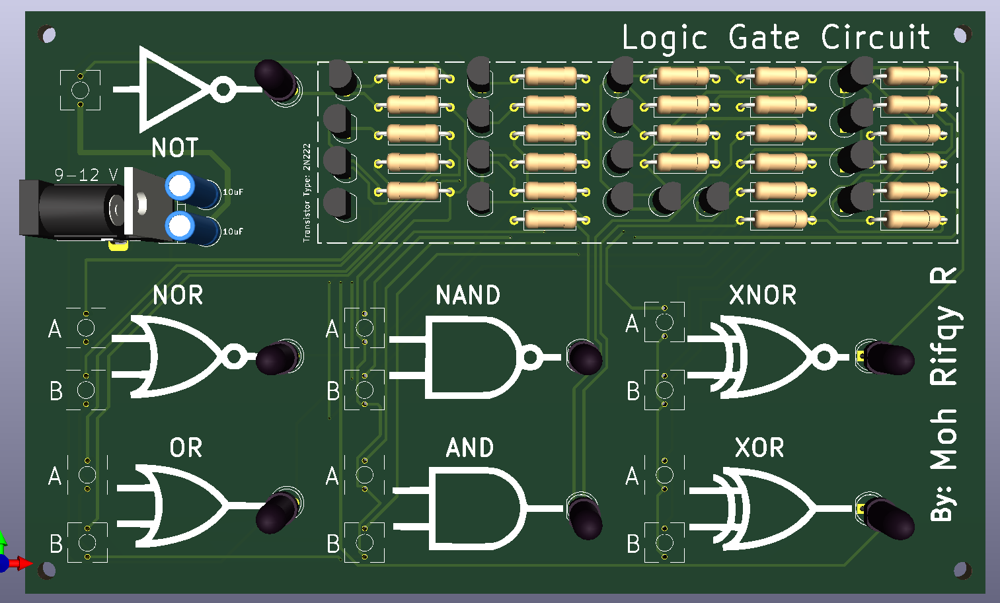

# Logic Gate Circuit
<table>
  <tr>
    <td align="center">
      
       3D View
    </td>
    <td align="center">
      
       Board View
    </td>
  </tr>
</table>

## Description
This project is a PCB design created with KiCad for simulating and testing basic logic gates: OR, AND, NOT, NOR, NAND, XOR, and XNOR. It is intended for educational purposes, allowing students or hobbyists to easily visualize and experiment with digital logic circuits. The board uses a LM7805 voltage regulator to provide a stable +5 V supply, 2N2222 transistors for logic gate implementation, push buttons as input switches, and resistors for biasing and pull-up/pull-down configurations.

## Bill of Materials (BOM)
| No. | Component                     | Quantity | Description / Value           | Package Type |
|-----|--------------------------------|----------|--------------------------------|--------------|
| 1   | LM7805 Voltage Regulator       | 1        | +5 V output, 1 A               | TO-220       |
| 2   | 2N2222 NPN Transistor          | 18       | For each logic gate output     | TO-92        |
| 3   | Push Button Switch             | 13        | Logic gate input control       | 2 pin 6x6x5 |
| 4   | Barrel Jack Connector          | 1        | DC input, 5–12 V               | THT          |
| 5   | LED Indicator                  | 7        | Logic output visualization     | 5 mm THT     |
| 6   | Capacitor (Electrolytic)       | 2        | 10 µF, for voltage smoothing   | Radial THT   |
| 7   | Resistor                       | Various  | Biasing & pull-up/pull-down    | Axial THT    |

For resistor specification, please check the schematic or board.
